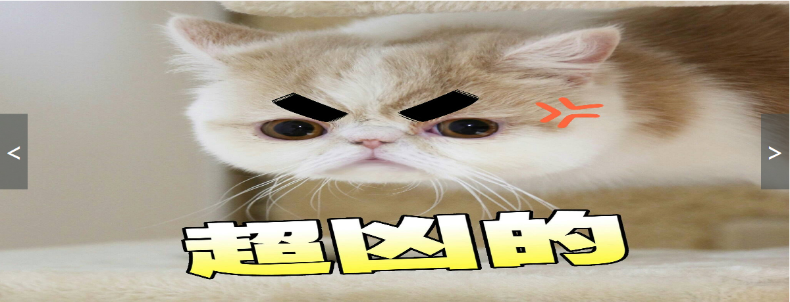

---
title: CSS应用-轮播
date: 2019-01-08 08:50:34
tags: CSS
---

> &emsp;图片轮播可以说是各大门户页面对CSS技术应用泛度最高的技术了，同时也是面试中对样式侧考核常见的题目，因为它综合了WEB的三大基本结构：HTML、JS、CSS。

## 简易的轮播实现

&emsp;&emsp;一般来讲，完整的轮播实现都会包括一个脚标处的对应图片数量的按钮切换以及左右侧的对应切换到前一张和后一张图的按钮。现在我们先不考虑这些功能，将焦点集中在图片的轮播切换上，实现一个简易的轮播功能。

&emsp;&emsp;**怎么做？**

### 页面布局

&emsp;&emsp;通过CHROME的控制台查看ELEMENTS我们可以很清楚地看到常见的轮播DOM构造都是以`ul`标签嵌套`li`标签实现的。在`li`标签内通过CSS的background属性指定url填充图片。

<escape><!-- more --></escape>

```html
    <div class="container">
        <div class="banner">
            <ul>
                <li class="banner-slide slide1 fullfilled">
                </li>
                <li class="banner-slide slide2 fullfilled">
                </li>
                <li class="banner-slide slide3 fullfilled">
                </li>
                <li class="banner-slide slide4 fullfilled">
                </li>
            </ul>
        </div>
    </div>
```

### 图片切换

&emsp;&emsp;有了基本的DOM框架，我们要如何进行图片背景的切换呢？核心就是**溢出隐藏**`overflow: hidden;`以及**控制显隐**`display: block; display: none;`。

```css
* {
    padding: 0;
    margin: 0;
}
 
.banner {
    position: absolute;
    margin: auto;
    width: 1200px;
    height: 460px;
    top: 0;
    left: 0;
    bottom: 0;
    right: 0;
    overflow: hidden;
}
 
.banner-slide {
    width: 1200px;
    height: 460px;
    background-repeat: no-repeat;
    position: absolute;
}
 
.slide1 {
    background-image: url("../images/1.jpg");
}
.slide2 {
    background-image: url("../images/2.jpg");
}
.slide3 {
    background-image: url("../images/3.jpg");
}
.slide4 {
    background-image: url("../images/4.jpg");
}

.fullfilled {
    background-size:100% 100%;
    -moz-background-size:100% 100%;
}
```

&emsp;&emsp;当然控制显隐的操作纯CSS也是能够处理的但没有JS控制那么灵活，这里我们通过JS来配合CSS属性实现，核心是在默认情况和鼠标移出轮播框区域时触发图片轮播动作的定时器函数，函数的操作内容就是循环将不展示的图片display设置为none，展示的设置为block。当鼠标拖入轮播框区域则清空定时器。

```javascript
var timer = null,
    index = 0,
    pics = document.getElementsByTagName("li");

function slideImg() {
    var banner = document.querySelector('.banner');
    banner.onmouseover = function(){
        stopAutoPlay();
    }
    banner.onmouseout = function(){
        startAutoPlay();
    }
    //默认开始播放
    banner.onmouseout();
}
//开始播放轮播图
function startAutoPlay(){
    timer = setInterval(function(){
        index++;
        if(index>3){
            index = 0;
        }
        changeImg();
    },1000);
}
//暂停播放
function stopAutoPlay(){
    if (timer) {
        clearInterval(timer);
    }
}
//改变轮播图
function changeImg(){
    for(var i=0;i<pics.length;i++){
        pics[i].style.display = "none";
    }
    pics[index].style.display = "block";
}
slideImg();
```

&emsp;&emsp;如此一个简易的轮播效果便实现了，效果见[传送门](http://www.chendiyou.com/cssDemo/lunbo)。

## 完整版的轮播实现

&emsp;&emsp;前面我们已经有了轮播切换的雏形，下面我们就完善其功能。

### 装上“翅膀”

&emsp;&emsp;增加左右切换按钮。

```html
    <div class="orientation left">
        <
    </div>
    <div class="orientation right">
        >
    </div>
```

```css
    .orientation {
        position: absolute;
        top: 50%;
        transform: translateY(-50%);
        color: white;
        height: 7.2rem;
        line-height: 7.2rem;
        width: 2.7rem;
        text-align: center;
        cursor: pointer;
        font-size: 250%;
        background-color: rgba(69, 76, 76, 0.582);
    }

    .left {
        left: 0;
    }

    .right {
        right: 0;
    }    
```
&emsp;&emsp;效果如下：
