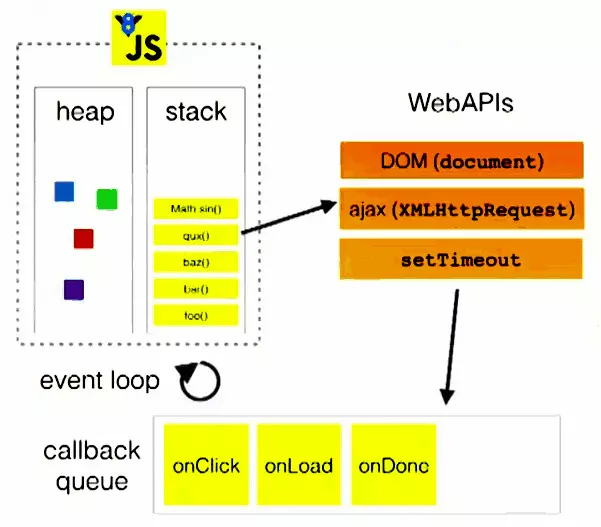
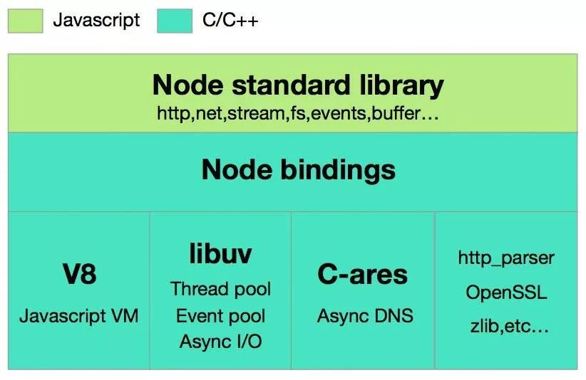
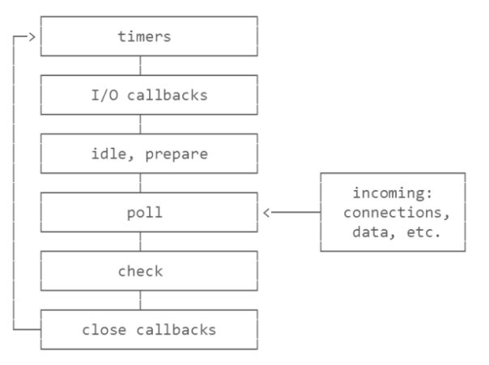

> &emsp;&emsp;搞懂Event Loop是一件很有意义的事情，不仅仅是你会在一些面试中遭遇，更多的是让你理解JS引擎在执行语句的时，与你预期不一致的“奇异”结果是如何产生的。

<escape><!-- more --></escape>
## 什么是Event Loop？

&emsp;&emsp;在开始讨论前，我们先区分下宿主环境(即当前JS引擎所运行的环境)：本文主要围绕Chrome浏览器和Node两个执行环境进行讨论。

### 浏览器环境(Chrome v8)

&emsp;&emsp;关于Chrome浏览器中以v8为js引擎内核的执行周期图在社区中比较常见，如下图所示：



&emsp;&emsp;Web中的Event Loop大致由4部分组成：**MicroTask、MacroTask、Web APIS、Stack** 。在讨论其执行过程时，我们还要区分**异步**和**同步**两种情况。

#### 同步

&emsp;&emsp;同步的情景比较简单，就是个简单的入栈、出栈过程，就以下面这块代码为例：

```javascript
  function a() {
    b();
  }
  function b() {
    c();
  }
  function c() {
    console.log('Hello World!');
  }
  a();
```
&emsp;&emsp;①：a被调用，a入栈；
&emsp;&emsp;②：a中调用了b，b入栈；
&emsp;&emsp;③：b中调用了c，c入栈；
&emsp;&emsp;④：c中调用log，log入栈；
&emsp;&emsp;⑤：log被执行，输出Hello World! ，log出栈；
&emsp;&emsp;⑥：以此类推，c、b、a 依次出栈；

#### 异步

&emsp;&emsp;异步场景中要考虑的东西就比较多，不过第一步一样是入栈；第二步，也就是浏览器发现我们的任务是异步任务后，会将这个任务交给前文图中的Web APIS去维护(此处像`onclick`这样的需要回调的也会交付给Web APIS)，Web APIS可以视作一个回调函数构成的队列，当其中的如`setTimeout`的计时器到时后，**会先检查当前执行栈Stack是否为空**，只有当执行栈清空后，这个回调的任务才会被压入栈中执行。

&emsp;&emsp;就这么简单？肯定不是，因为我们放入Web APIS中的任务还要进行区分，这里可以分为两类任务，**宏任务(Macro Task)以及微任务(Micro Task)**。

##### 宏任务(Macro Task)与微任务(Micro Task)

&emsp;&emsp;先看看哪些任务属于宏任务的范畴？

&emsp;&emsp;1、MessageChannel;
&emsp;&emsp;2、setTimeout;
&emsp;&emsp;3、setInterval;
&emsp;&emsp;4、setImmediate(Node);
&emsp;&emsp;5、I/O;
&emsp;&emsp;6、UI Rendering;

&emsp;&emsp;再看看哪些任务属于微任务的范畴？

&emsp;&emsp;1、Promise.then;
&emsp;&emsp;2、Object.observe;
&emsp;&emsp;3、MutationObserver;
&emsp;&emsp;4、process.nextTick(Node);

&emsp;&emsp;它们有什么联系？

&emsp;&emsp;①：宏任务与微任务都是Queue的数据结构；
&emsp;&emsp;②：微任务具有比宏任务更高的执行优先级；
&emsp;&emsp;③：微任务会等待执行栈Stack清空后再执行；
&emsp;&emsp;④：当微任务队列开始往Stack中压入执行动作时，它会一次性将当前队列中的所有任务清空；

### Node环境

&emsp;&emsp;下面来看看Node环境与前面讨论的浏览器环境Event Loop的执行差异，为何会有差异？虽然Node也使用了v8的JS解析引擎，但是I/O层使用了自己设计的libuv，libuv是一个基于事件驱动的跨平台抽象层，封装了不同操作系统一些底层特性，对外提供统一的API，Event Loop也在其中实现。

#### 核心组成(三层)



&emsp;&emsp;- Node标准库(第一层)： 我们在Node中平常调用的API；
&emsp;&emsp;- Node绑定层(第二层)： 这一层是JS与底层的C/C++的绑定层，JS通过binding与底层交换数据；
&emsp;&emsp;- Node实现层(第三层)： 本层由C/C++ 实现:

&emsp;&emsp;&emsp;&emsp;**V8:**Google推的JSVM，提供了JS在非浏览器端运行的环境；
&emsp;&emsp;&emsp;&emsp;**libuv:**为Node提供线程池，事件池，异步 I/O 的能力；
&emsp;&emsp;&emsp;&emsp;**C-ares:**为Node提供异步处理 DNS 相关的能力；
&emsp;&emsp;&emsp;&emsp;**http_parser、OpenSSL、zlib 等:**为Node提供包括 http 解析、SSL、数据压缩等其他的能力；

#### libuv实现的Event Loop



&emsp;&emsp;- timers(queue)： 执行setTimeout和setInterval的回调；
&emsp;&emsp;- I/O callbacks： 执行几乎所有异常的close回调、由timers和setImmediate执行的回调；
&emsp;&emsp;- idle, prepare： 仅用于内部的一些事件；
&emsp;&emsp;- poll： fs的文件I/O操作；获取新的I/O事件；Node在该阶段会适当阻塞；
&emsp;&emsp;- check： setImmediate回调会被调用；
&emsp;&emsp;- close callbacks： 关闭的回调，如socket;

&emsp;&emsp;在理清前文两图的基础上，我们可能还会想到一个问题：Node不是单线程么？其实在看到前面Node的核心组成时，我们就该清楚严格意义上Node只有主线程是单线程的，真正的第三层实现层libuv为Node提供了线程池和事件池，下面屡一下：

&emsp;&emsp;1、每个Node进程只有一个主线程在跑，会有一个执行栈Stack，它就是我们所说的“单线程”，根据代码的顺序走下来，遇到同步的阻塞就会被占用，后续代码将不会被执行；
&emsp;&emsp;2、当主线程遇到网络请求或异步操作时，就会将这些任务放入Event Queue中，等主线程执行完，再通过Event Loop来执行队列中的任务；这些队列任务会按队列的FIFQ规则依次从线程池中分配一个线程去处理；清空队列后，当有事件执行完毕，就会通知主线程，主线程执行回调，线程归还给线程池；所以其实主线程的I/O是不会阻塞的，因为交给Event Loop去处理了，即我们常说的非阻塞I/O；

&emsp;&emsp;搞懂了Node的基本执行逻辑，我们现在可以仔细盘一下这个Libuv实现的Event Loop流程图了，图中的每一个阶段其实都是一个队列结构，我们主要关心的是**timers、poll、check**这三个阶段：

&emsp;&emsp;&emsp;&emsp;- timers阶段: 队列会处理到期的timers任务，开始poll队列为空；
&emsp;&emsp;&emsp;&emsp;- poll阶段: 处理队列任务，直到队列清空或到达上限；poll阶段为空时，会检查是否有到期的timers任务；
&emsp;&emsp;&emsp;&emsp;- check阶段: 当队列为空时，如果有setImmediate，终止poll阶段，进入check阶段，如果没setImmediate，查看有无定时器任务到期，有就进入timers阶段，执行回调；

#### setTimeout与setImmediate

&emsp;&emsp;`setImmediate`是Node中的API，用于在当前任务队列尾部添加事件，与`setTimeout(fn, 0)`有点类似，但是两者的执行顺序在不同的队列阶段有所不同：

&emsp;&emsp;①：在非I/O循环中，两者的执行顺序是不确定的；
&emsp;&emsp;②：在I/O循环中，`setImmediate`总是先于`setTimeout`执行，从前文中我们知道I/O的一些相关操作会在poll阶段执行，遇到setImmediate后会终止当前阶段，进入check阶段回调，然后再进入timers进行setTimeout的回调；

&emsp;&emsp;**PS: `setTimeout(fn, delay)`，在NODE中如果不是1≤delay≤`TIMEOUT_MAX`，`delay`将被置为`1ms`，而浏览器环境则会被置为`4ms`**；

#### Process.nextTick与Promise.then的执行顺序

&emsp;&emsp;`process.nextTick() `，不管当前正处于Event Loop的哪一个阶段队列，都会在当前阶段队列任务执行完跳入下一个阶段前的瞬间执行，即**具有比`Promise.then`更高的执行优先级**；

### 浏览器环境 vs NODE环境

&emsp;&emsp;对比两个环境下的Event Loop我们可以很明显发现在Node中并不是将任务一个个拿到栈中执行，而是待一个阶段队列任务执行清空或到达上限后才会进入到别的阶段队列进行操作；另外若是其中的任务是微任务，则会在队列切换时被执行，即我们所谓的**“插缝执行”**。

### 实际场景（做做题？）

&emsp;&emsp;1、以下代码在浏览器环境和NODE环境分别会输出什么？

```javascript
setTimeout(() => {
  console.log(1);
  Promise.resolve(3).then(res => {
    console.log(res);
  })
}, 0);
setTimeout(() => {
  console.log(2);
}, 0);
```

&emsp;&emsp;这个问题，在浏览器环境中的输出结果是没有争议的：**1 3 2**。

&emsp;&emsp;流程：
&emsp;&emsp;①：第一个setTimeout入栈，发现是异步任务交付Web APIS回调队列维护；
&emsp;&emsp;②：第二个setTimeout入栈，发现是异步任务交付Web APIS回调队列维护；
&emsp;&emsp;③：此时栈空，Web APIS开始执行第一个回调，log入栈，输出1，出栈；
&emsp;&emsp;④：紧接着发现Promise.resolve是微任务，将其加入微任务队列；
&emsp;&emsp;⑤：此时栈空，由于微任务比宏任务具有更高的执行优先级，微任务被回调，输出3；
&emsp;&emsp;⑥：最后剩下的宏任务被回调，输出2；

&emsp;&emsp;但是NODE的输出结果就比较有意思了，可能是**1 3 2**也可能是**1 2 3**；这时候有人会疑惑，按照前文中的描述，队列进行切换的时候才会执行微任务，我这不是2个`setTimeout`都在一个timers里么，那不是应该先输出`1 2`再在下次切换队列的时候输出`3`么？其实你这样想已经get到了一半，出现`1 3 2`的原因是由于在当前timers阶段内第一个`setTimeout`的整个回调已经执行完毕了，但是第二个`setTimeout`还没有到时，被加进来，那它就只能在第二轮(下一个tick)里的timers执行了，自然先输出`1 3`，再输出`2`；由于前面的例题代码，只有`1ms`的delay，即便是性能不同的机器也不一定能输出两种结果，但是为了证明前面我们的推论，可以将第二个`setTimtout`的delay放大，比如我改成`1000`的delay，那输出将是恒定的`1 3 2`：

<p></p>


