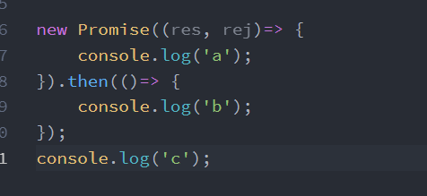

> &emsp;这篇文章就让我们来聊聊Promise的前世今生。

## 什么是Promise？

&emsp;&emsp;Promise封装了依赖于时间的状态，等待底层值的完成(resolved)或拒绝(rejected)，故Promise本身是与时间无关的，它能够按可预测的方式组合而无需关心时序或底层结果。一个Promise在决策后，将会Immutable化，并且当前Promise上通过then注册的回调都会在下一个异步时机点上（Event Loop见另一篇博文<<Event-Loop一次盘清楚>>）依次被立即调用。

<escape><!-- more --></escape>

### 构造函数下的Promise是什么状态？

&emsp;&emsp;我们知道Promise在得到决策结果前有一个`pending`状态，表明当前Promise处于等待状态。我们通过Promise构造函数得到的Promise实例就是处于pending状态，如下图所示：


&emsp;&emsp;**注：Promise构造函数中的函数执行是同步的。**

&emsp;&emsp;当然这里处于`pending`也与我们实例化时内部没有进行指定状态有关：

```javascript
let initPromise = new Promise((res, rej) => {
    if (/* 异步成功操作逻辑 */) {
        res(/* 生成实例then方法中指定resolved状态的入参 */);
    } else {
        rej(/* 错误时的异常信息 */);
    }
}) 
```

### 指定决策后状态的回调

&emsp;&emsp;在我们的实例生成以后，可以用then方法分别指定resolved状态和rejected状态的回调函数，如下代码所示：

```javascript
initPromise.then(function(value) {
  // resolved
}, function(error) {
  // rejected
});
```

&emsp;&emsp;到这里你大概觉得已经明白Promise的基本用法了，那可以看看下图中的输出结果是什么：



&emsp;&emsp;最终输出的只有**a c**，推理也很简单，答案的推论都在前文的叙述中有所提及，再结合上一篇文章Event Loop的基础：第一个和第二个分别输出`a`，`c`应该是不会有异议的，两者均属于同步，有人的疑问可能是为什么`b`没有输出？从前文我们知道实例化的then是可以接收2个参数的，图中仅传入一个参数那就是对应了`resolved`时的回调，可是在前面实例化Promise时，并没有逻辑指定最后的决策结果，所以Promise还处于一个`pending`状态，所以这个then内的回调自然是无法被触发的，最终输出`a c`。

&emsp;&emsp;有点感觉了？那再来几个试试？

```javascript
Promise.resolve(1).then(2).then(Promise.resolve(3)).then(console.log);
```

&emsp;&emsp;开始这个问题的分析前，我们需要先理清一个概念，**Promise.resolve**的作用是什么？它能将现有对象(入参)转化成Promise对象，我们可以分为几种情况讨论：

&emsp;&emsp;①：**参数是一个 Promise 实例**，`Promise.resolve`将会原封不动地返回这个实例。
&emsp;&emsp;②：**参数是一个 `thenable` 对象**，`thenable`对象指的是具有then方法的对象：

```javascript
let thenable = {
  then: function(resolve, reject) {
    resolve('Hello World!');
  }
};

let p1 = Promise.resolve(thenable);

p1.then(function(output) {
  console.log(output);  // Hello World!
});
```

&emsp;&emsp;③：**参数不是对象**，即当我们的入参是个原始值时，它会经过工厂函数转为对应原始值类型对象，然后`Promise.resolve`返回一个状态为`resolved`的新Promise对象，并且该方法的参数会同时传给`then`方法内的回调函数。
&emsp;&emsp;④：**不带有任何参数**，直接返回一个`resolved`状态的Promise对象。

&emsp;&emsp;OK，我们回到正题，第一个`resolve`使这个Promise实例状态变为`resolved`并且基本类型1转化为对象后向后面then中的回调传递，我们看到第一个`then`中只有一个参数2，根据前文我们知道此处走的是`then`的`resolve`回调，入参是2，**但是没有返回值**。再看到第二个`then`内，传入了一个`resolved`的Promise，但同样没有返回，故最后一个`then`的回调内还是接收的第一个`Promise.resolve`往后传的1，最终输出`1`。

&emsp;&emsp;注：每次`then`方法调用都会返回一个新的Promise实例。