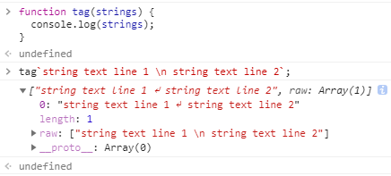
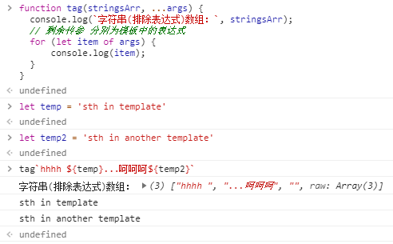

> &emsp;有时候我们会在一些地方看到令人眼前一亮的代码，这里并不是指设计模式或者可读性、维护性那些如何精妙而是指这代码操作你没用过！

<escape><!-- more --></escape>

## 带标签的模板字符串

&emsp;&emsp;先说是什么：标签使我们可以用函数解析模板字符串。标签函数的第一个参数包含一个字符串值的数组（其中的元素由模板剔除表达式后的字符串组成），其余的参数与表达式相关；

```javascript
function tag(strings) {
  console.log(strings);
}
```



&emsp;&emsp;这里的标签函数只有一个入参，所以输出的是包含这个字符串的数组，并且该数组内还有一个`raw`属性，我们可以通过该属性访问模板字符串的原始字符串。另外`String.raw()`创建原始字符串和使用默认模板函数和字符串连接创建是等价的：

```javascript
var str = String.raw`Hi\n${2+3}!`;
// "Hi\n5!"

str.length;
// 6

str.split('').join(',');
// "H,i,\,n,5,!"
```

&emsp;&emsp;如果是多参数的情景：

```javascript
function tag(stringsArr, ...args) {
  console.log(`字符串(排除表达式)数组：`, stringsArr);
  // 剩余传参 分别为模板中的表达式
  for (let item of args) {
      console.log(item);
  }
}
```



&emsp;&emsp;从输出结果中我们可以发现，第一个字符串数组内的元素是将模板字符串以表达式为分界符隔开的元素组成的，比如`${temp}`前是`hhhh `，像`${temp2}`后，没有跟随其他元素，则会提供空串给字符串数组。其后的传参则由模板中的表达式组成；

## ~操作符与~~操作